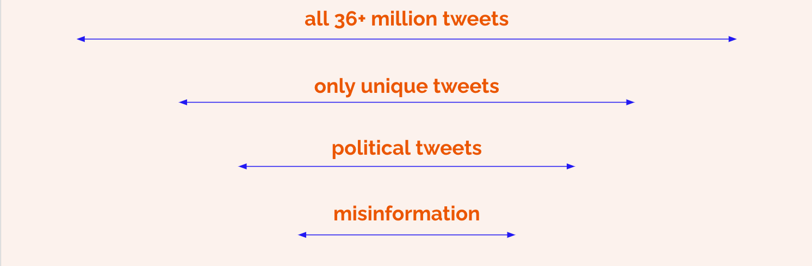
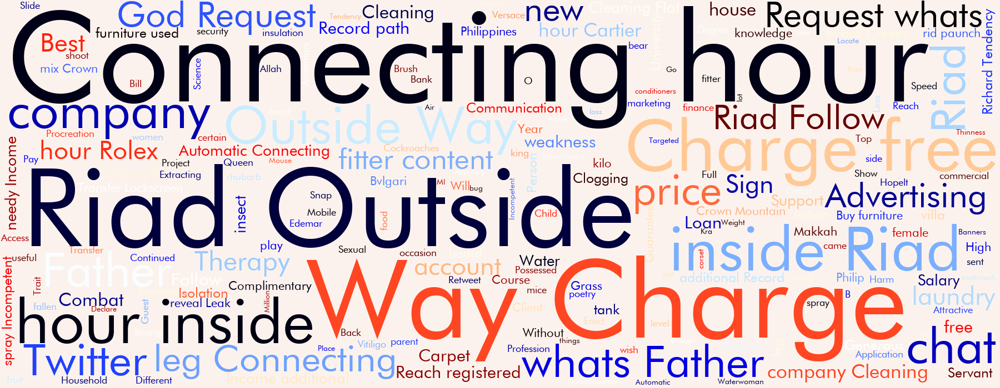
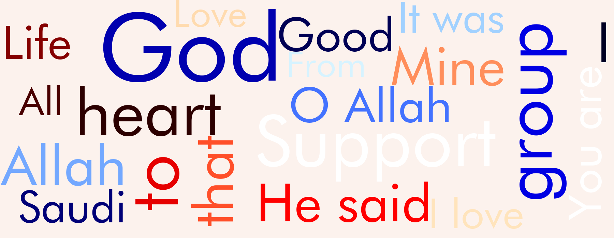
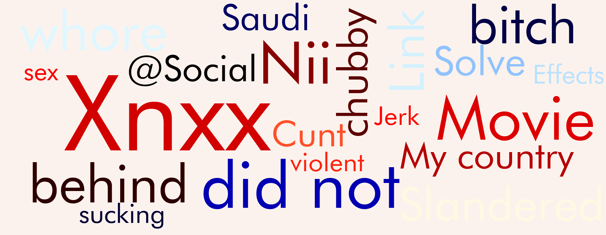
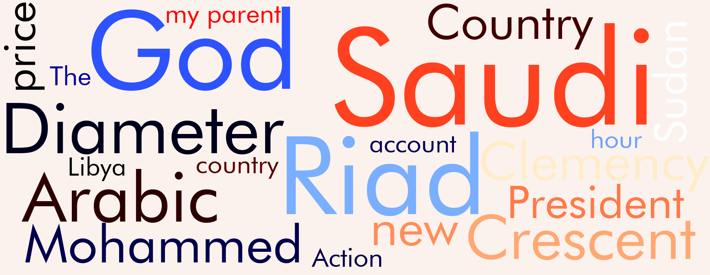
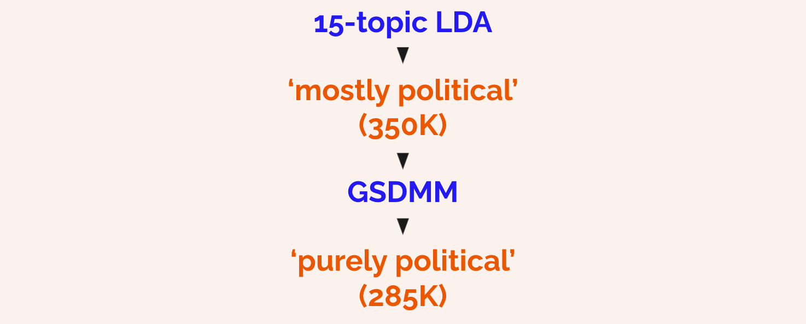
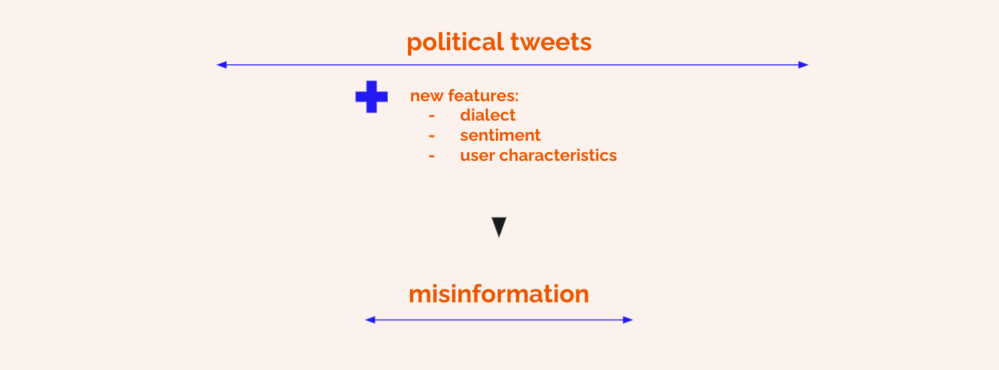

# What the Tweet?! -- Identifying Arabic-Language Political Misinformation on Twitter
**Using unsupervised NLP topic modelling and clustering to build a machine learning classifier that can identify misinformation in short-text documents.**

## Introduction
The internet — and social media, especially — is rife with political misinformation. Besides being a potential nuisance when scrolling through your Twitter feed, this misinformation can also have dramatic real-world repercussions, like the January 6 storming of the U.S. Capitol. For this reason, detecting political misinformation and hate speech is a major challenge for organisations in the political, humanitarian and intelligence sectors. One of the main challenges in fighting misinformation is the lack of labelled datasets, especially in low-resource languages.

After speaking to several people involved in misinformation and hate speech detection across a range of organisations, I decided to use my final Capstone Project of the Springboard Data Science Career Track to address some of these issues. With this project, I hope to contribute to the ongoing research in this field by looking specifically at the tools and processes necessary to detect political misinformation in Arabic-language tweets.

## The Dataset
For this project, I make use of a dataset from Twitter’s [Transparency Center](https://transparency.twitter.com/en/reports/information-operations.html) consisting of 5,350 Twitter accounts (and all of their 36+ million tweets, 95 percent of which are in Arabic) that have been identified by Twitter as being part of state-linked Information Operations.

In Twitter’s own words:

“A network of accounts associated with Saudi Arabia and operating out of multiple countries including KSA, Egypt and UAE, were amplifying content praising Saudi leadership, and critical of Qatar and Turkish activity in Yemen. A total of 5,350 accounts were removed.”

The data was downloaded on February 26, 2021.

## The Approach
An important thing to note here is that the accounts were identified as ‘compromised’ and not every single one of its Tweets, per se. This meant that it wasn’t a given that all of the 36M tweets actually contained political misinformation.

The goal of the project, then, was to figure out how to boil the 36+ million tweets down to the actual political misinformation content.

I do this in 3 steps:
1. **Wrangling**: Clean the data to get only the unique tweets.
2. **Topic Modelling**: Perform NLP-driven categorisation of the unique tweets to sift out all the end-of-the-workday cat memes and other junk and get only the political content.
3. **Clustering**: Apply unsupervised learning methods to further distinguish between political content and political misinformation.

Which then prepares us for the final step:

4. **Classification**: Using the output to construct an ML classifier.

## Data Wrangling (see notebook 01-rrp-data-wrangling)
Besides the usual NLP data wrangling steps like removing URL’s, emoji, hashtags, repeating characters, etc. this project also involved some pre-processing specific to Arabic NLP. In [this Medium post](https://towardsdatascience.com/arabic-nlp-unique-challenges-and-their-solutions-d99e8a87893d), I provide an in-depth tutorial and explanations as to the particular challenges of working with Arabic text…and how to overcome them using the versatile camel-tools Python package.

After removing all non-Arabic tweets (~3%) and all duplicate content (i.e. re-tweets), we were left with 6.15 million unique Arabic-language tweets.

## Summary Statistics and EDA (see notebook 02-rrp-exploratory-data-analysis)
Before we move on to looking at what these 6.15 million unique tweets were about, it’s worth mentioning some basic information about the tweeting behaviour in the dataset.

The dataset contains:
- 35.3 million Arabic tweets
- 4,273 unique users
- tweets published between February 15, 2010 and January 22, 2020 (most tweets in 2018 and 2019)

Looking at the distribution of tweets, followers, and followings across users (in the complete 36M dataset), we notice some extremely skewed patterns, for example:
- # Followers per user: ranging from 0 to 1.2 million, with a median of 100.
- # Following per user: ranging from 0 to 877k, with a median of 228.
- Top 1% most-followed users produced almost half of the 35M tweets
- Tweets per user: ranging from 1–1.4 million (~4.2% of the whole dataset) — median: 203

Looking at just the unique tweets, we see:
- 6.1M unique tweets
- more than 4M unique tweets show up only once in the dataset
- 78 unique tweets show up more than 10,000 times
- these 78 unique tweets together make up 4.5% of the dataset (more than 1.5M tweets)

All of this is indicative of **extreme amplification**: a small number of users and tweets being overrepresented in the dataset and drowning out the ‘normal’ tweeting behaviour.

A closer look at the top-100 most recurring unique tweets also revealed large amounts of non-political content. Below is a word cloud of the most common words included in those top-100 tweets:

It’s hard to identify much explicitly political content in here. This could perhaps make a case for a strategy of drowning political misinformation in general ‘junk’ to avoid it being detected.

At the end of the **exploratory data analysis**, I could confidently identify 3 overarching clusters of content:
- Religious
- Commercial
- Political

## Topic Modelling (see notebook 03-rrp-topic-modelling)
This three-way split was helpful in guiding my work in the next step: moving from the 6.15 million unique tweets to the specifically political content using topic modelling. I used two different topic modelling approaches in order to sift out the political content: **Latent Dirichlet Allocation** (LDA) and **Gibbs Sampling Dirichlet Multinomial Mixture** (GSDMM).

While LDA is by far the most popular topic-modelling approach out there, it assumes multiple topics per document. GSDMM, on the other hand, is built specifically for short-text clustering and assumes only a single topic per document. Seeing as our documents are max. 140 characters long, it seems reasonable to assume that they contain only a single topic.

NOTE: In [an accompanying Medium article](https://richardpelgrim.medium.com/short-text-topic-modelling-lda-vs-gsdmm-20f1db742e14), I dive deeper into the inner workings and lay out the pro’s and con’s of LDA and GSDMM.

I ran multiple iterations of each model, tweaking their hyperparameters to compare their performance. Hands-down, the GSDMM models did a better job of identifying coherent topics and pulling out the specifically political ones. Below are word clouds of some of the topics identified by the GSDMM model. 

Unfortunately, the GSDMM model was only able to do this when running on a subsample of the data containing 100K tweets. When I attempted to pass the GSDMM model the full dataset of 6.15M unique tweets, the model either failed or would take multiple days to run.

Since GSDMM cannot be parallelised as of June 2021, I ended up engineering a work-around in which I took the output from the best LDA model — a total of 350k, let’s call them, ‘mostly political’ tweets — and fed that into our GSDMM model for a final pass to sift out the junk from the funk. This worked really well and yielded a coherent subset of 285k ‘purely political’ tweets, categorised into 4 sub-topics.

## Clustering (see notebook 04-rrp-clustering)
The data is now all set for the next envisioned step: using unsupervised learning to break the political tweets down into ‘neutral’ and ‘misinformation’ content specifically.

The idea here was to go beyond looking only at the textual content of the tweets and to add features into the mix that could potentially help distinguish between ‘neutral’ and ‘misinformation’ political content.

These new features included data on:
- the dialect in which the tweet was written (which can be inferred using the camel-tools library)
- the sentiment of the tweet: positive, negative, or neutral
- a number of features summarising characteristics of the user who tweeted the tweet, such as: the total number of tweets created by this user, the number of tweets with identical timestamps created by this user (as a potential indication of bot-like behaviour), and the number of followers/following.

### Geography of Dialects
Generating the dialect feature had the interesting side-effect of giving us additional data about the geographical spread of the tweets in this dataset. The map below shows the number of tweets per each of the 26 dialects. The dialects are named according to the major cities in which they’re most commonly used. Of course, a dialect is spoken in a region much larger than a single city. And there’s no guarantee that a person writing in the Lebanese dialect is actually tweeting from Lebanon. So while we should take the map below with a grain (spoonful!) of salt, there’s still some useful information in here about the geography and demographics of the users in this dataset.

After engineering the new features, I then tried to run the new dataframe through a number of different clustering algorithms: K-Means, t-SNE, and Hierarchical Clustering. Unfortunately, I ran headfirst into the technical limitations of the libraries I was working with at this point, as well as the time limitations of the project. Because of the size of the dataset (285k rows * 10K+ features), and the inability to parallelise the clustering algorithms effectively, I have not (yet!) been able to run the entire dataset through a meaningful clustering algorithm.

I did manage to run a 5% subsample through a t-SNE clustering, however. That revealed a large number of small clusters which seemed pretty effectively defined by the GSDMM Topic label, as can be seen in the screenshot below.

A bit of a disappointment, of course; but also a solid lesson in the realistic limitations of a data science project, both technically and practically. I still think that this avenue is worth exploring, though, and am keen to spend more time trying to figure out the ins-and-outs of running these clustering algorithms in distributed clusters and exploring meaningful ways of teasing the two categories (misinformation or not) out.

## Key Takeaways
The project in its current state offers (at least) the following 4 insights:
- Arabic NLP presents its own set of challenges…which take some digging into but are definitely surmountable, especially with the help of the camel-tools package.
- Topic Modelling on Arabic tweets works…and pretty effectively, too!
- The trade-offs of opting for LDA over GSDMM when working with short-text documents are considerable…but it’s possible to combine them to get the best of both worlds.
- The world of distributed processing really is a different ballgame in some respects, and poses a number of extra challenges that require extra time and grit to overcome.

## What’s Next?
Going forward, I want to dig my teeth into at least three ways to expand this project:
- Further exploration of the clustering approach, incl. PCA, distributed t-SNE / Spectral
- Communication with Python communities regarding possibilities to extend GSDMM to run in distributed mode
- Extensive network analysis to detect patterns in user interaction and explore potential for the attribution of these information operations to specific nodes in the network.

If you’re reading this and have an idea or some constructive input, please do get in touch, I'd love to hear from you!