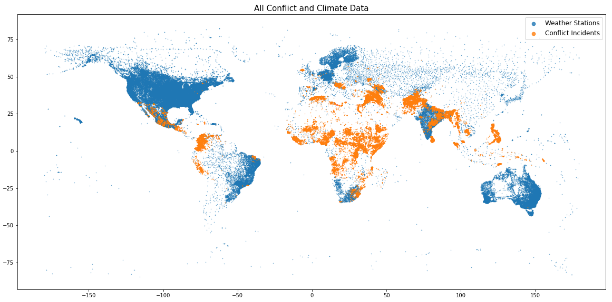

# Heated Discussions: Predicting Conflict Intensity Using Climate Data

Climate change is increasingly causing [extreme weather patterns](https://www.carbonbrief.org/mapped-how-climate-change-affects-extreme-weather-around-the-world) across the globe. These extreme weather situations, such as high temperatures, drought, floods, etc., are causing massive population movements and increased competition over land and other natural resources. This competition can lead to political tension and may take the form of armed conflict.

Against this background, this project sets out to investigate whether a direct relationship can be established between climate measures and conflict intensity measures. Establishing such a relationship would be valuable to:
1. illustrate yet another reason to increase efforts to mitigate climate change as soon as possible,
2. anticipate conflict intensity and necessary aid and/or military interventions based on expected weather patterns,

[Researchers at Stanford](https://news.stanford.edu/2019/06/12/climate-change-cause-armed-conflict/) and other universities have speculated about the possible relationship between climate change and increases in armed conflict. However, most experts point out that this relationships remains largely speculative and would be hard to prove, since there are so many other contributing factors that drive conflict, such as geopolitical and/or socioeconomic factors. The guiding research question of this project is therefore:

**To what extent can we predict conflict intensity from climate data?**

Read [full project report](https://towardsdatascience.com/heated-discussions-predicting-conflict-intensity-using-climate-data-7084d623f8d2) on Towards Data Science.

Watch [project presentation](https://www.youtube.com/watch?v=2DDwaDBQkg0&ab_channel=RichardPelgrim) on YouTube (20min).

Complete Jupyter Notebooks for each section can be found in the 'notebooks' directory.

## 1. Data

This project combines data from two separate sources:
1. the [Uppsala Conflict Data Program Global Armed Conflict dataset](https://ucdp.uu.se/downloads/) containing information on 220k+ conflict incidents between 1989 and 2019, and
2. the [Global Historical Climatology Network Daily](https://www.ncei.noaa.gov/access/metadata/landing-page/bin/iso?id=gov.noaa.ncdc:C00861) dataset containing weather measurements from 115k+ stations across the globe between 1889 and 2020.

The UCDP Armed Conflict features can be categorised as follows:
* chronological: year, start and end date
* geospatial: latitude, longitude, country, top-level administrative region / province, second-level administrative region
* political: the parties engaged in the conflict
* intensity measures: duration and number of deaths, divided into side a, side b, civilian and unknown
* administrative: data quality indicators and other administrative information

The GHCN climate features can be categorised as follows:
* station metadata: unique ID, latitude, longitude, country, elevation
* weather features: Precipitation level, Average / Max / Min Temperatures, Snow fall, Snow depth, etc.
* administrative: data quality indicators, etc.

Both datasets were accessed and downloaded on October 20, 2020.

## 2. Combining Datasets

In order to begin to answer our research question, these two datasets would have to be combined in a sensible, informative manner. Our goal was to create a dataframe with *conflict incidents as observations (rows)* and then to match each incident to relevant weather data from a nearby station. This is possible because both datasets contain exact geospatial coordinates for stations and conflict incidents, respectively.

Since conflict incident is our unit of observation, we only need weather data from stations within roughly the same area. We therefore subsetted the weather data to include only data from stations that were within 50km of any conflict incidents. This reduced the size of the weather data by about 90%.

In order to decide how exactly to match the data effectively - and to get a proper sense of the quality and distribution of our data - extensive exploratory data analysis was conducted before proceeding.

## 3. Exploratory Data Analysis

The EDA phase of this project consisted of three phases:
1. Overall inspection of original dataset features
2. Exploration of global climate and conflict patterns
3. Deep-dive into climate and conflict patterns for a specific country

Phase 1 revealed a number of important facts about our datasets:
* extremely high number (>90%) of missing values for Snowfall and SnowDepth. These features were subsequently omitted.
* high number of missing values (~55%) for Temperature
* Precipitation values were extremely skewed, with ~76% 0 values
* death_count variable had some extreme outliers corresponding to aggregated events
* not all weather stations had measurements for all of the years: coverage was especially sparse for temperature measurements before 1960 and after 2012.

This latter observation proved to be particularly pertinent. It meant we would have to be careful about ensuring that the stations we included in our analysis in fact had the relevant records for the years we were interested in (especially 1989-2019, the years during which the conflict incidents occurred).

Phase 2 of the EDA, revealed the following noteworthy global patterns:
* the mean Precipitation level near conflict incidents is below the global average for 2019
* the mean Temperature level near conflict incidents is above the global average for 2019
* Syria, Afghanistan, and India have the highest number of conflict incidents
* a dramatic trend of increasing conflict incidents over the observed period (1989-2019)
* there seem to be seasonal peaks in number of conflict incidents reported, with the months April to August consistently above average.

At this point in the analysis, we proceeded to try and identify geospatial patterns between conflict and climate data; could we pinpoint areas of the globe that were seeing extreme weather and extreme conflict? This proved very hard to evaluate on a global level because of the massive amounts of data points and the inability to visually see how this plays out on a more fine-grained, local leve. All we could say at this point is that there are regions that consistently experience extreme temperature and precipitation levels.

Given this and the geopolitical context-specific nature of conflicts, we decided to focus our analysis on a single country, as an initial case study on which to build our model.
Before continuing, we do want to highlight this map of conflict incidents coloured by year and with marker size set by the total death count as an example of communicative power of data visualisation. The Rwandan genocide jumps out of this image, and other atrocities (such as the Srebrenica massacre and the 9/11 attack) can also be clearly identified.

## 4. Country Case Study: India

We explored 3 potential candidates (with the highest conflict incident counts): Syria, Afghanistan, and India. India was selected because it had both a high number of conflict incidents and a high number of weather stations; 15000+ and 3800+, respectively. While Syria and Afghanistan both had more conflict incidents, they had far fewer weather stations: 12 and 4, respectively.

We then matched each conflict incident with the nearest of the 3800 Indian weather stations, using a CkdTree nearest-neighbour classifier. This left us with a subset of 743 unique stations. However, upon further investigation, we discovered that the vast majority of these stations only had precipitation data, for years far preceding the years in which the conflict incidents occurred.

We could either continue with the 743 stations, yielding more locale-specific measurements but sacrificing contemporaneity with conflict data, or use only the subset of stations that had data for the years in which the conflict happened. We opted for the latter, as we are most interested in finding patterns between climate measures and conflict incidents and so *contemporaneity* is the most important.

This meant we were left with a further subset of the Indian weather stations, totalling 25 weather stations. Fortunately, these 25 stations were pretty evenly spread over the country and there is at least 1 stations for each visible cluster of conflict incidents.

The matching function was run again, matching each conflict incident with the nearest of these 25 stations. To retain a degree of geographic homogeneity, rows were dropped for which the distance between the incident and the nearest station was more than 300km.

## 5. Feature Engineering

We then calculated a number of climate feature means for each station and added these to the dataframe containing the conflict incidents. Besides the original conflict features, each conflict incident now also contained the following features (belonging to the nearest of the 25 weather stations):

* means of specific 5 year intervals for which TAVG and PRCP are collected sufficiently 
* climate means (for all 4 features) for the year of the conflict
* change in climate means (for all 4 features) between 1973 and the year of the conflict 
* change in climate means (for all 4 features) between 1973 and 2019

## 6. Principal Components Analysis

Having engineered a total of 32 weather-related features, we ran a Principal Components Analysis on these 32 features to see if we could spot any clusters in the data. Plotting the first two components - which account for over 83% of the variance - revealed some clusters. Coloring the plot by our target feature total_deaths did not reveal interesting patterns. Coloring by latitude and longitude did, however, indicating that the collection of weather features could potentially be summarized by these two features.

## 7. Correlations

As a final step in our EDA, we explored the correlations between the features in our dataset.

This revealed two important observations:
* total_deaths was not significantly correlated with any of the climate features 
* there is a slight correlation between total_deaths and duration_days.

This latter observation makes logical sense, as death count can be expected to increase as a conflict drags on. For this reason, we decided here to adjust our target feature: instead of total_deaths, *our model will predict the death_rate ( = total_deaths / duration_days)*.

## 8. Final Dataset

Based on the analysis above, then, we select death_rate as our target feature. Our model will predict the death rate based on available weather data from the region around the conflict incident.

Since the PCA revealed that the weather features effectively contain the information encoded in the features latitude and longitude, we will remove these from our predictor set. Since the weather features are inherently time-based (yearly / 5-year interval means), we will also remove the feature year.

This means we will proceed to build a model which will use only climate features to predict the conflict intensity, measured in terms of deaths per day. This means our final dataframe has 32 predictor features and 1 target feature. The total number of rows is 14364.

## 9. Model Building

In the Modelling phase, we first built a DummyRegressor model which simply predicts the mean of the target feature. This serves as the baseline model against which to compare the performance of our other models.

We then built 3 regression models: 
1. Linear Regression
2. Random Forest Regression
3. Lasso Regression

All models were constructed using a SciKit-Learn pipeline which included a SimpleImputer (using the median) for missing values, as well as a StandardScaler.

The figure above presents the performance metrics of the models on the test set. Based on these results, corroborated by the results of our EDA, we conclude that *it is not possible to accurately predict the intensity of conflicts in India (measured as deaths per day) from the chosen climate predictor features*.

## 9. Future Research

The current analysis involved a number of key decision moments that determined the course of the project. Future research into this topic should start by exploring the other potential routes that could have been taken, namely:
* *Comparing areas with conflict to areas without conflict.* This would require a different unit of observation (namely ‘area’, potentially defined as country or smaller geographical region). Such a model could then predict something like ‘conflict density’: number of conflict incidents per unit area.
* *Expanding the scope of the project* beyond the first case study to include other and/or multiple countries in one model.
* *Sourcing additional data* that would allow more fine-grained modelling of climate data at local levels, i.e. use a larger subset of weather stations than currently available.

During the Exploratory Data Analysis phase of this project, a number of interesting avenues for future research not directly related to this model were discovered. We list some of them below:
* Conflicts have, on the whole, moved North over the past thirty years. Could this be related to increasing temperatures and overall population movements towards more Northern parts of the world?
* There seem to be seasonal peaks in the conflict data. This could be very interesting to explore further. This is confirmed when we group conflict incidents by Month: the months April to August are above average. Do conflicts tend to occur in warmer months?
* There are clearly global regions that consistently experience both extreme temperature and precipitation levels: could these be regions that are experiencing extreme weather in general?

## 10. Acknowledgments

A big shout-out to my mentor Guy Maskall for his invaluable support to making this project come alive.
