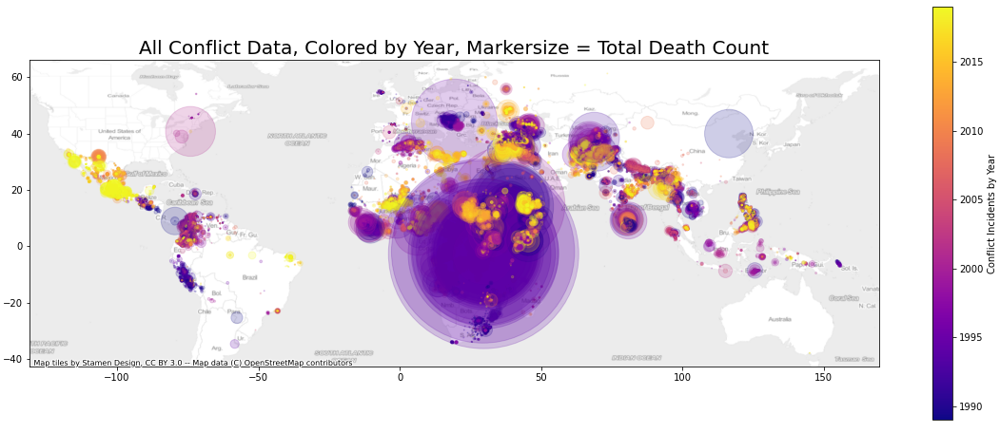

# 0_CAPSTONE_Conflict_Climate_Prediction
This is my first Capstone Project, completed as part of the Springboard Data Science Career Track. In this project, I investigate to what extent it is possible to predict conflict intensity based on climate data. Project design, data collection, and complete execution were done independently.

See README in project directory for more information, incl. project outline and key findings.

#  1_ski_resort_price_prediction
This case study was completed as part of the Springboard Data Science Career Track curriculum. In this project, I investigate the contribution of a ski resort's features (e.g. slope elevation, number of lifts, etc.) to its ticket price, based on comparison to 300+ comparable resorts. A predictive model is built and business recommendations are made.